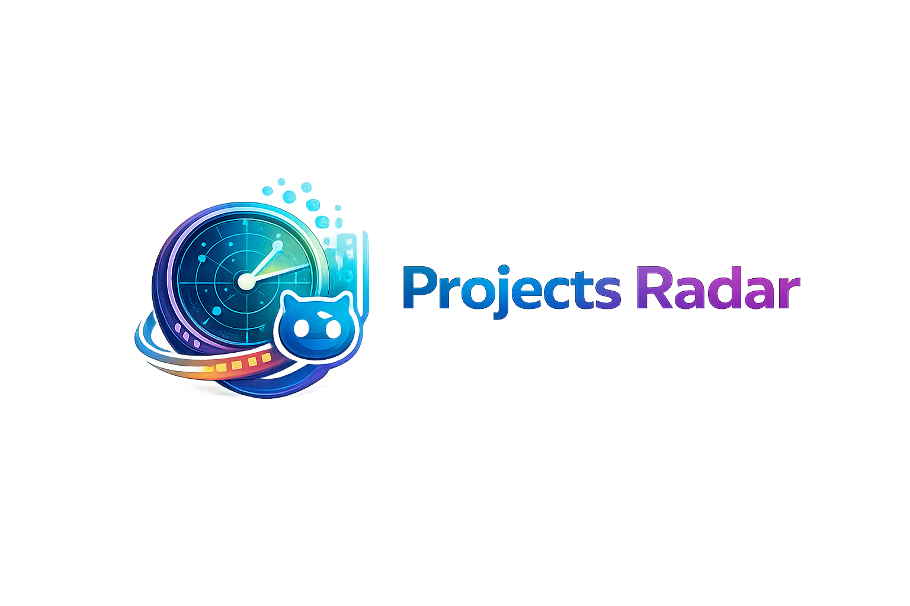

<p align="center">
  
</p>

<h1 align="center">Projects Radar</h1>

Projects Radar is a web dashboard that analyzes and processes GitHub repositories to generate README content, screenshots, short descriptions, and tech-stack insights. The app provides a repository listing UI, queue management, and background workers that run AI and scanner jobs.

<!-- [Live Demo](https://...) -->

## Features

- **Repository discovery & sync:** Finds and syncs repositories by owner, with visibility and fork filters.
- **Batch generation:** Produce README files, screenshots, and short descriptions via API endpoints and background jobs.
- **AI-assisted analysis:** Uses OpenAI to summarize code, detect tech stacks, and generate short descriptions.
- **Queue & worker system:** Background processing with `bullmq` and Redis, plus a UI for queue status and controls.
- **Tech stack detection:** Scans repo files to infer frameworks, languages, and packages.
- **Repo controls:** UI actions to refresh, hide/unhide, and re-run analysis for individual repos.

## Getting Started

**Prerequisites**

- **Node.js:** 18+ recommended
- **Package manager:** `npm`, `pnpm`, or `yarn`
- **Redis:** Required for `bullmq` background queues
- **Optional:** Local SQLite (via `better-sqlite3`) for lightweight persistence
- **Env vars:** `GITHUB_TOKEN`, `OPENAI_API_KEY`, `REDIS_URL` (and any database path settings)

**Installation & Development**

1. Clone the repo and install dependencies:

   ```bash
   git clone <repo-url>
   cd projects-radar
   npm install
   ```

2. Create a `.env` with required keys (see Prerequisites).

3. Start the app (development):

   ```bash
   npm run dev
   ```

- Build for production: `npm run build`
- Start production server: `npm start`
- Clear queue utility: `npm run clear-queue`

## Project Structure

- **`src/app/`** — Next.js app routes and pages (UI and server API endpoints).
- **`src/components/`** — Reusable UI components such as `repo-card`, `tech-stack-display`, and form controls used across the dashboard.
- **`src/lib/`** — Core backend logic:
  - `github.ts` — GitHub API helpers and repo sync logic
  - `repo-cloner.ts` — Clones repos locally for analysis
  - `screenshot-generator.ts` — Produces screenshots of repository content
  - `source-code-analyzer.ts` & `tech-stack-detection.ts` — Analyze code to detect stack and produce insights
  - `ai.ts` & `copilot-analyzer.ts` — OpenAI wrappers and analysis orchestration
  - `bullmq-worker.ts` & `bullmq.ts` — Queue processing and worker setup
- **`src/app/api/`** — Server routes that trigger batch jobs (generate READMEs, screenshots, descriptions) and queue endpoints.
- **`src/scripts/`** — Convenience scripts (e.g., `clear-queue.ts`).
- **`src/types/`** — Shared TypeScript types.

Key UI pages include `queue-management`, `queue-status`, and per-repo views under `src/app/repos`.

## Tech Stack

- **Next.js** ^16 — React framework for server rendering and routing
- **React** 19.2 — UI library
- **TypeScript** ^5.9 — Static typing
- **Tailwind CSS** ^4.1 — Utility-first styling
- **BullMQ** ^5.10 — Background job queue
- **Redis** ^4.7 — Queue broker used by BullMQ
- **better-sqlite3** ^12 — Lightweight local persistence
- **OpenAI** ^6.7 — AI-assisted content generation
- **Playwright** ^1.56 — Used for screenshot generation/testing

For a complete dependency list and exact versions, see `package.json`.
